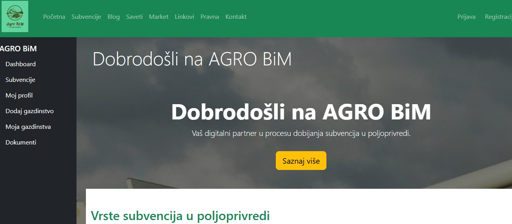

# Agro BiM - Agro-shopp platforma


---



---

## 🇷🇸 Srpski opis

Dobrodošli u projekat **Agro BiM / Agro-shopp**!  
Ova platforma omogućava:

- ✅ Registraciju i prijavu korisnika (kupci, admini)
- ✅ Postavljanje, uređivanje i brisanje proizvoda
- ✅ Organizaciju proizvoda po poljoprivrednim rubrikama i podrubrikama
- ✅ Pretragu proizvoda po imenu i opisu
- ✅ Isticanje proizvoda na početnu stranicu
- ✅ Admin panel za upravljanje proizvodima
- ✅ Moderan, responzivan dizajn

---


## 📂 Struktura projekta
/backend → Laravel 12 API (Agro BiM backend) /frontend → React aplikacija (Agro-shopp frontend)


---

## 🛠 Tehnologije korišćene

- Frontend: **React**, **Bootstrap**, **Axios**
- Backend: **Laravel 12**, **MySQL**
- Autentifikacija: **Laravel Sanctum**

---

## 🚀 Pokretanje projekta

### Backend (Laravel)

```bash
cd backend
cp .env.example .env
composer install
php artisan key:generate
php artisan migrate --seed
php artisan storage:link
php artisan serve

### Frontend (React)

cd frontend
npm install
npm start

#### Frontend će se pokrenuti na / Frontend will be available at:

http://localhost:3000

#### Backend na / Backend will be running at:

http://127.0.0.1:8000

🧩 Planirane funkcionalnosti
✅ Korpa i porudžbine

✅ Plaćanje i dostava

✅ Višekriterijumsko filtriranje (akcija, organski proizvod, dostava...)

✅ Višejezičnost (srpski/engleski interfejs)

📜 Licenca
Sva prava zadržana © 2025 Agro BiM


🇬🇧 English description
Agro BiM - Agro-shopp platform
Welcome to the Agro BiM / Agro-shopp project!
This platform enables:

✅ User registration and login (buyers, admins)

✅ Posting, editing, and deleting products

✅ Product organization by agricultural sectors and subcategories

✅ Search products by name and description

✅ Highlight featured products on homepage

✅ Admin panel for product management

✅ Modern, responsive design

📂 Project structure

/backend   → Laravel 12 API (Agro BiM backend)
/frontend  → React app (Agro-shopp frontend)


🚀 Running the project
Backend (Laravel)
cd backend
cp .env.example .env
composer install
php artisan key:generate
php artisan migrate --seed
php artisan storage:link
php artisan serve

Frontend (React)
cd frontend
npm install
npm start

🧩 Planned features

✅ Shopping cart and orders

✅ Payment and delivery integration

✅ Advanced filtering (on sale, organic, delivery available...)

✅ Multilanguage (Serbian/English interface)

📜 License
All rights reserved © 2025 Agro BiM
